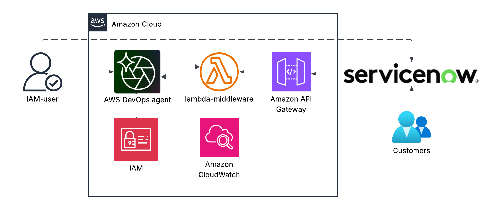
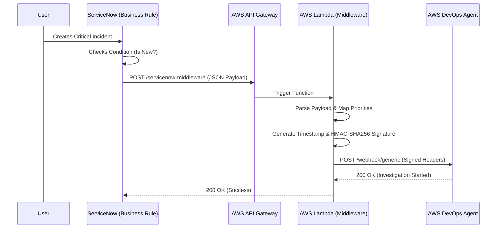

# ServiceNow - aws devops agent serverless (lambda) middleware 

## Description:
This project connects ServiceNow Incidents to the AWS DevOps Agent using a serverless middleware. It allows the AWS Agent to automatically investigate AWS resources and identify the root cause of issues reported in ServiceNow.

## Purpose:
To automate the detection and analysis of AWS resource issues by triggering the DevOps Agent directly from ServiceNow incidents, speeding up incident resolution.


## Architecture Design





***Decoupling**: ServiceNow sends simple JSON data; AWS Lambda handles the complex signing logic.*
## 🚀 Implementation Guide
#### Phase 1: AWS Configuration
1. Configure DevOps Agent
- Navigate to AWS Console > DevOps Agent.
- Create a Generic Webhook (*Imp:* You need the OAuth Client ID and Secret Key from ServiceNow)
- Save the Webhook URL and Secret Key.

2. Create Lambda Function
- Create a function named ServiceNowToDevOps (Python 3.12+).
- Add API Gateway as a trigger (Create a new HTTP API, Security: Open/None for demo).
- **Code:** [lambda_middleware.py](lambda_middleware.py) Use the *urllib3* version.


### Phase 2: ServiceNow Implementation

1. Go to ServiceNow Developer Portal:

    Visit: https://developer.servicenow.com/

2. After account creation, click "Request Instance"
3. Access Your Instance:
    Instance URL format: https://devXXXXX.service-now.com
    Username: admin
    Password: [provided in email]

4. Create Integration User
    Navigate to User Management:

    Go to: All → User Administration → Users
    Click: New
    ```markdown
    User ID: sn_aws_integration
    First name: ServiceNow
    Last name: AWS Integration
    Email: aws-integration@yourcompany.com
    Password: [Create strong password - save this!]
    Active: ✓ (checked)
    Web service access only: ✓ (checked)
    Add these roles if required.
    ```
    

5. Set Up OAuth 2.0 Application
    Application Registry
    Select: "Create an OAuth API endpoint for external clients"
    Name: AWS DevOps Agent OAuth
    Client ID: [Auto-generated]
    Client Secret: [Auto-generated]
    Redirect URL: https://your-aws-devops-agent.com/oauth/callback
    OAuth Application User: Select the user from step 4.
    After saving, scroll down to "OAuth API Scopes" section
    Click New and add:
    ```yml
    Scope 1: useraccount
    Scope 2: read  
    Scope 3: write
    ```

6. Business Rule
    Click ("All"), type Business Rules.
    Click System Definition → Business Rules.
    Click New (Top Right).
    Configure the Rule Settings
    ```yaml
    Name: Notify AWS DevOps Agent
    Table: Incident [incident]
    ```

**code:** [Business_rule.js](Business_rule.js)
*Note:* change the lambdaUrl (go to lambda → Configuration → Trigger)

8. Test End-to-End Integration
    Create Test Incident:
    Go to: Incident → Create New

### 9. Future work
Make the agent to resolve the ticket.
Add the secrect key to AWS secrects manager

### 10. Troubleshoot
Check the cloudwatch logs for lambda.
make sure api Gateway auth to NoneCheck ServiceNow Logs:

servicenow:
Go to: All → System Logs → System Log → All
Filter by: Source contains "AWS DevOps"
Look for webhook success/failure messages